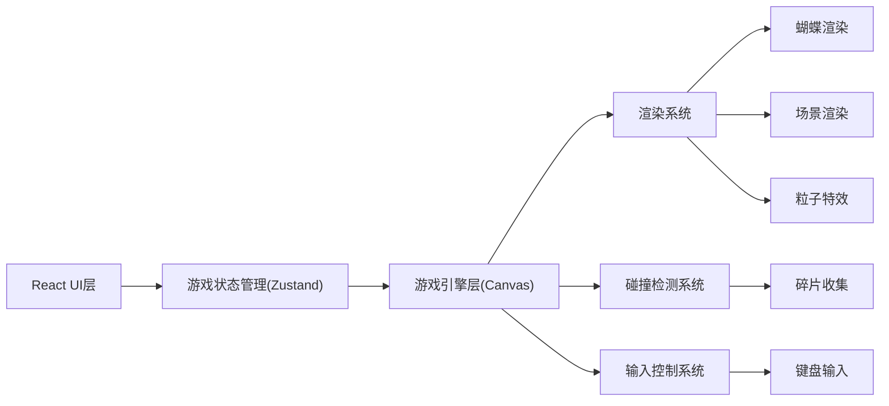

## 1. 架构设计



## 2. 技术描述
- **前端框架**：React@18 + TypeScript
- **构建工具**：Vite
- **样式方案**：TailwindCSS@3
- **状态管理**：Zustand
- **游戏渲染**：原生HTML5 Canvas 2D
- **初始化工具**：vite-init
- **后端**：无（纯前端）

## 3. 路由定义
| Route | 用途 |
|-------|---------|
| / | 开始界面 |
| /game | 游戏主场景 |

## 4. 数据模型

### 4.1 游戏状态
```typescript
interface GameState {
  butterfly: {
    x: number;
    y: number;
    vx: number;
    vy: number;
    rotation: number;
  };
  fragments: Fragment[];
  collectedFragments: string[];
  unlockedStories: string[];
  isPlaying: boolean;
  showStory: boolean;
  currentStory: Story | null;
  showStoryBook: boolean;
}

interface Fragment {
  id: string;
  x: number;
  y: number;
  collected: boolean;
  storyId: string;
  glowPhase: number;
}

interface Story {
  id: string;
  title: string;
  content: string;
  fragmentId: string;
  order: number;
}
```

### 4.2 故事数据
游戏包含6个记忆碎片，对应6段故事，讲述蝴蝶与小女孩在花园中的美好回忆：

```
1. 初见 - 春日花园的初次相遇
2. 约定 - 在樱花树下许下的诺言
3. 夏日 - 阳光午后的秘密花园
4. 离别 - 秋天来临时的告别
5. 等待 - 寒冬中孤独的守候
6. 重逢 - 永恒的记忆与温暖
```

## 5. 项目结构
```
src/
├── components/
│   ├── StartScreen.tsx      # 开始界面
│   ├── GameCanvas.tsx       # 游戏Canvas主组件
│   ├── HUD.tsx              # 游戏HUD界面
│   ├── StoryModal.tsx       # 故事弹窗
│   └── StoryBook.tsx        # 故事合集
├── hooks/
│   └── useGameLoop.ts       # 游戏循环Hook
├── store/
│   └── gameStore.ts         # Zustand状态管理
├── data/
│   ├── fragments.ts         # 碎片配置数据
│   └── stories.ts           # 故事文本数据
├── types/
│   └── game.ts              # 类型定义
├── utils/
│   └── gameEngine.ts        # 游戏引擎工具函数
├── pages/
│   ├── Start.tsx            # 开始页
│   └── Game.tsx             # 游戏页
├── App.tsx
├── main.tsx
└── index.css
```
