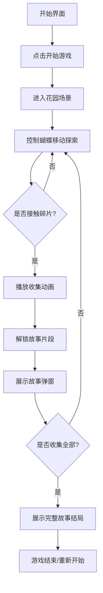

## 1. 产品概述
《蝶忆》是一款治愈系2D探索小游戏，玩家操控一只蝴蝶在梦幻花园中自由飞舞，收集散落各处的记忆碎片，解锁一段关于重逢与告别的温柔故事。

- 目标用户：喜欢治愈游戏、探索类游戏、独立小游戏的玩家
- 产品价值：提供一段静谧、温暖的沉浸式体验，通过视觉与文字的结合触动玩家情感

## 2. 核心功能

### 2.1 功能模块
1. **开始界面**：游戏标题、开始按钮、操作说明
2. **花园探索场景**：2D俯视视角地图、蝴蝶角色、花草装饰元素
3. **记忆碎片收集系统**：碎片散布地图、碰撞检测、收集动画
4. **故事解锁系统**：收集碎片后触发故事弹窗、渐进式剧情解锁
5. **进度展示**：已收集碎片数量、故事收集进度条

### 2.2 页面详情
| 页面名称 | 模块名称 | 功能描述 |
|-----------|-------------|---------------------|
| 开始界面 | 标题区 | 游戏标题艺术字、梦幻背景粒子动画 |
| 开始界面 | 操作区 | 开始按钮、操作说明（方向键/WASD移动） |
| 游戏主界面 | 花园地图 | 2D俯视花园场景，包含草地、花朵、树木、小径 |
| 游戏主界面 | 蝴蝶角色 | 玩家控制的蝴蝶，带扇动翅膀动画 |
| 游戏主界面 | 记忆碎片 | 散落在地图各处的发光碎片 |
| 游戏主界面 | HUD界面 | 碎片计数、进度条、已解锁故事列表入口 |
| 故事弹窗 | 故事展示 | 展示解锁的记忆故事文字、关闭按钮、继续探索按钮 |

## 3. 核心流程
玩家从开始界面进入游戏，控制蝴蝶在花园中探索飞舞。当蝴蝶接触到记忆碎片时，触发收集动画并解锁对应的故事片段。收集所有碎片后，完整的故事呈现在玩家面前。

## 4. 用户界面设计

### 4.1 设计风格
- **主色调**：梦幻紫（#9B7EDC）、樱花粉（#FFB6C8）、薄荷绿（#A8E6CF）、天空蓝（#87CEEB）
- **辅助色**：月光白（#FFF8E7）、深林绿（#2D5A3D）、暖金色（#FFD93D）
- **按钮风格**：圆润胶囊形状，带柔和发光效果，悬停时有放大动画
- **字体**：标题使用优雅衬线字体（Noto Serif SC），正文使用圆润无衬线字体（Noto Sans SC）
- **布局风格**：全屏沉浸式场景，HUD采用半透明玻璃质感
- **视觉元素**：飘落花瓣、闪烁萤火虫、柔光光晕

### 4.2 页面设计概述
| 页面名称 | 模块名称 | UI元素 |
|-----------|-------------|-------------|
| 开始界面 | 标题区 | 居中大字标题「蝶忆」，副标题梦幻字体，飘落花瓣背景 |
| 开始界面 | 操作区 | 发光圆形按钮、键盘操作图示 |
| 游戏主界面 | 花园场景 | 渐变绿色草地、多彩花朵、树木、弯曲小径、流动光粒子 |
| 游戏主界面 | 蝴蝶角色 | 彩色翅膀、扇动动画、飞行轨迹光效 |
| 游戏主界面 | 记忆碎片 | 菱形发光晶体、脉冲光晕、漂浮动画 |
| 游戏主界面 | HUD | 左上角碎片计数器、顶部进度条、右下角故事手册按钮 |
| 故事弹窗 | 故事卡片 | 半透明玻璃卡片、优雅排版文字、柔和淡入动画 |

### 4.3 响应性
桌面端优先，支持全键盘操作。自适应不同屏幕尺寸，游戏场景使用Canvas渲染保持全屏铺满。
